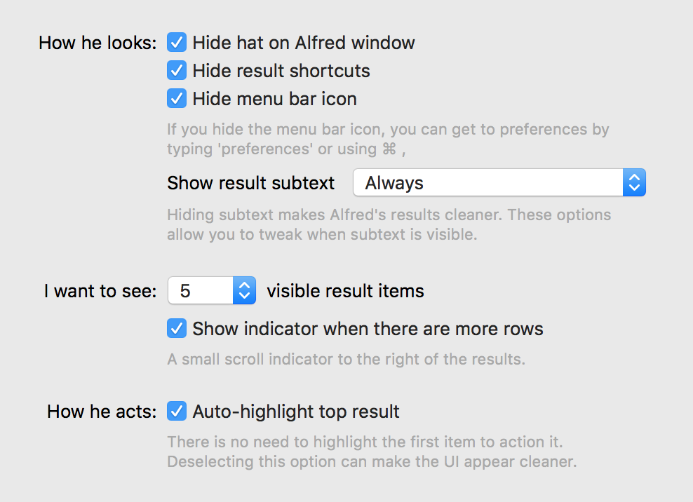

# alfred-simple-dark

> Simple Dark theme for [Alfred](https://www.alfredapp.com).

## Install

[Install the theme](https://www.alfredapp.com/extras/theme/C6TDs1XYnC/).

*You need the [Powerpack](https://www.alfredapp.com/powerpack/) for custom themes.*

## Options

Use the following options to have it look exactly like in the screenshot above.

## Related

- [alfred-simple](https://github.com/sindresorhus/alfred-simple) - Simple theme for Alfred.
- [alfred-emoj](https://github.com/sindresorhus/alfred-emoj) - Find relevant emoji from text.
- [alfred-npms](https://github.com/sindresorhus/alfred-npms) - Search for npm packages with npms.io.

## License

MIT © [Kiko Beats](https://kikobeats.com)
